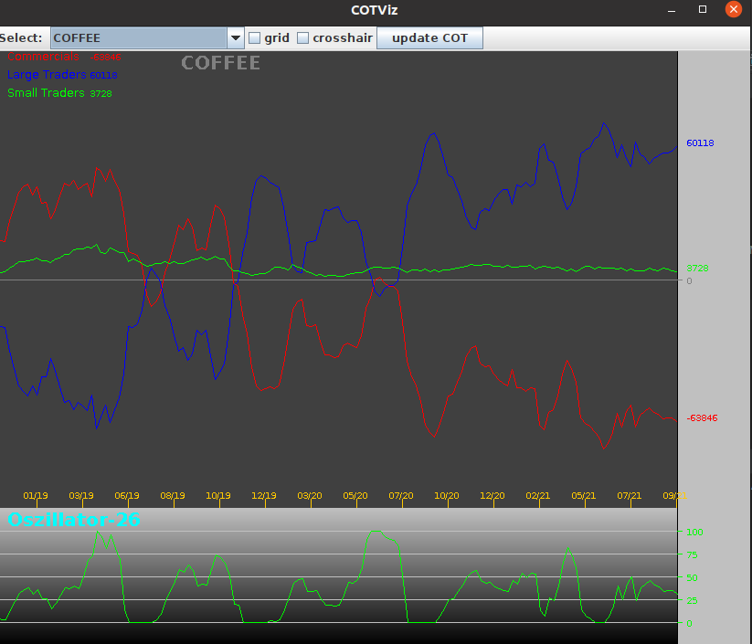
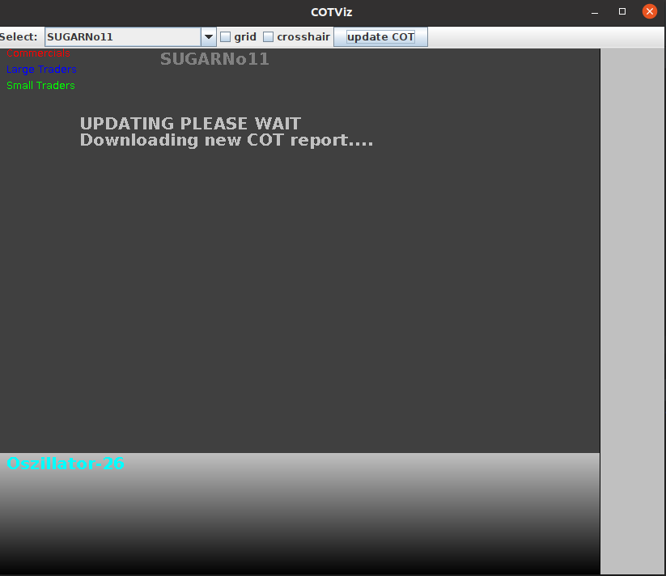

# About
Visualization tool for COT (commitment of traders) Charts.The tool downloads all required excel files from the CFTC Website unzips them, 
then extracts the data needed for the charts. Update every Friday (click ```update``` button) when the COT reports are published. 
The tool displays two charts. On the top the COT chart, on the bottom an oscillator.

## COT chart
In the COT report there are 3 main groups of traders:<br>
- commercials traders (commercials) <br> this are companies that produce a commodity, like corn, coffee, etc, and they use the Futures to hedge their risk. They are mostly positioned in the opposite direction of the other two groups.
- non-commercial traders (large traders) <br>  this are large instututional investors and hedge fonds.
- retail traders (small traders) <br> their positions are too small and hence they don't have to report them.

## Oscillator
An Oscillator is a technical analysis tool. It helps determining whether a market is overbought or oversold. The oscillator values fluctuate within an upper and lower bound. When the oscillator values reach the upper/lower bound, that could be a hint that the market is overbought/undersold.





## Requirements
```Apache POI```library has to be installed. <br>
The following are the required jars:
- ```commons-math3-3.6.1.jar```
- ```poi-5.0.0.jar```
- ```poi-examples-5.0.0.jar```
- ```poi-excelant-5.0.0.jar```
- ```poi-integration-5.0.0.jar```
- ```poi-ooxml-5.0.0.jar```
- ```poi-ooxml-full-5.0.0.jar```
