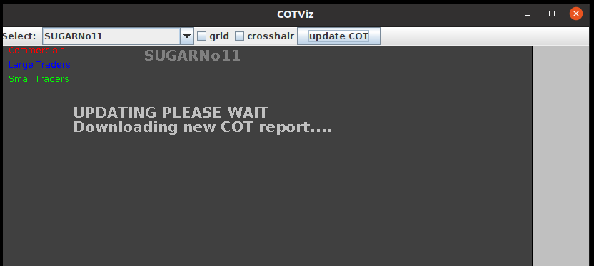

# COT-Charts
Visualization tool for COT (commitment of traders) Charts.The tool downloads all required excel files from the CFTC Website unzips them, 
then extracts the data needed for the charts. Update every Friday (click update button) when the COT reports are published. 
Apache POI libraries have to be installed first. 

