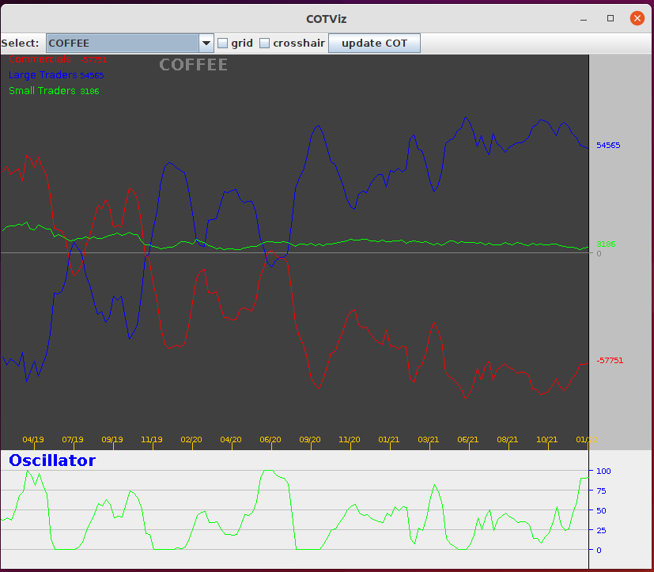

# About
Visualization tool for COT (commitment of traders) Charts.The tool downloads all required excel files from the CFTC Website unzips them, 
then extracts the data needed for the charts. Update every Friday (click ```update``` button) when the COT reports are published. 
Apache POI libraries have to be installed first. <br>
The tool displays two charts. On the top the COT chart, on the bottom an oscillator.

## COT chart
In the COT report there are 3 main groups of traders:<br>
- commercials traders (coomercials)
- non-commercial traders (lage traders)
- retail traders (small traders)
The commercial traders are companies that produce a commidity, like corn, coffee, etc, and they use the Futures to hedge their risk. <br>
The non-commercial traders are  large instututional investors and hedge fonds.<br>
The retail traders are too small and hence they do not have to report their positions.
## Oscillator
An Oscillator is a technical analysis tool. It helps determining whether a market is overbought or oversold. The oscillator values fluctuate within an upper and lower bound. When the oscillator values reach the upper/lower bound, that could be a hint that the market is overbought/undersold.





